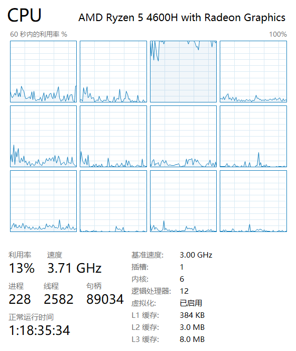
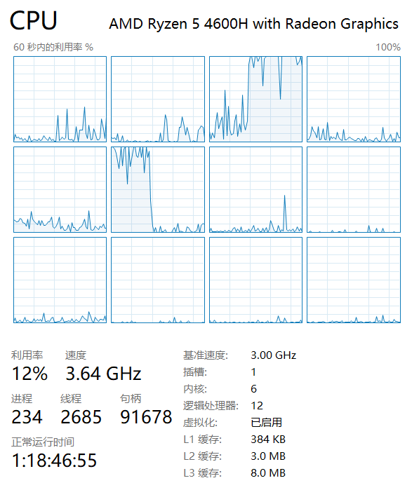
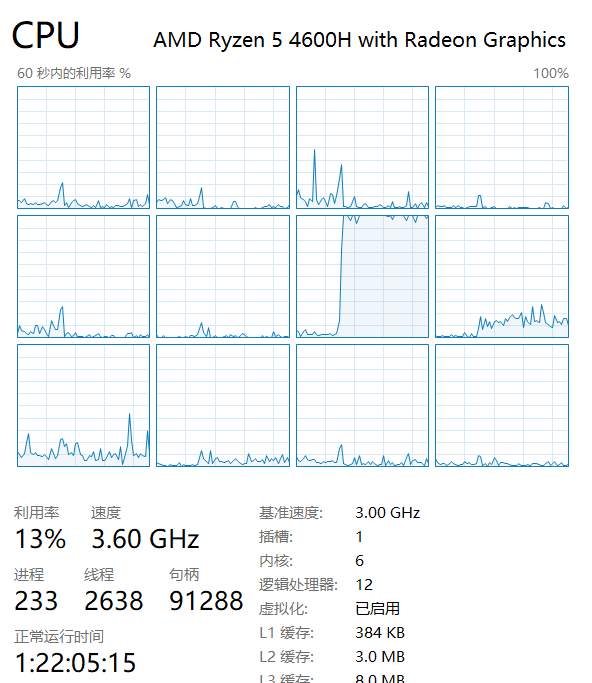
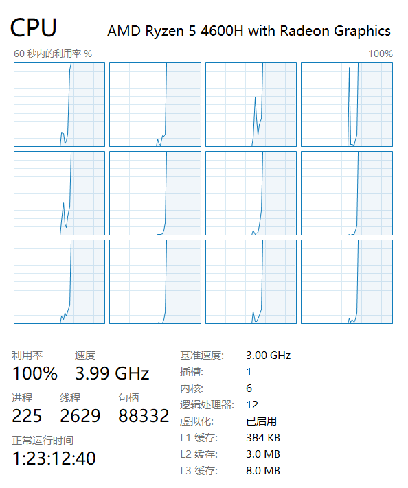
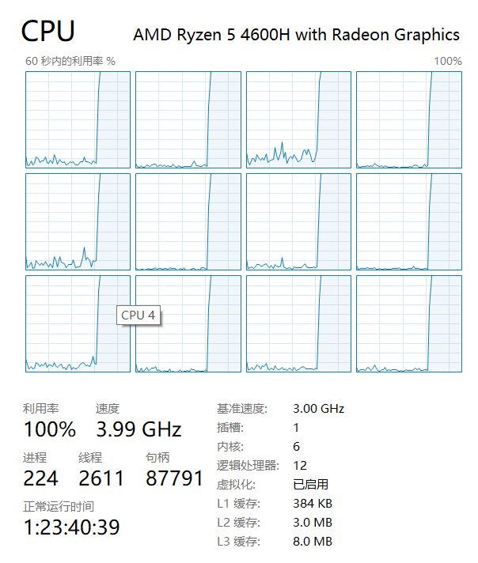

# 利用 Goroutine 优化求素数与完美数的算法

初始创建于：***2020/12/29***

最后编辑于：***2021/01/01***

## 基础概念辨析

先把几个基础概念给弄明白。

### 核心（core）

> 1970年代以前，中央处理器（CPU）由多个独立单元构成，后来发展出由集成电路制造的中央处理器，这些高度收缩的组件就是所谓的微处理器，其中分出的中央处理器最为复杂的电路可以做成单一微小功能强大的单元，也就是所谓的核心。`$$^{[1]}`

核心数就是指的物理层面上 CPU 有几个核，个人感觉挺好理解的，没必要多讲。

### 线程（thread）(CPU)

一开始查线程这方面的资料时发现好多说法都不尽相同，后来才明白他们谈的线程原来不是同一个线程 ... 有的说的是 CPU 层面的，但更多人谈到进程时指的都是操作系统层面，不过这里为了确保文章内容的循序渐进，先只介绍硬件层面的。

> 线程数是一种逻辑的概念，简单地说，就是模拟出的CPU核心数。比如，可以通过一个CPU核心数模拟出2线程的CPU，也就是说，这个单核心的CPU被模拟成了一个类似双核心CPU的功能。我们从任务管理器的性能标签页中看到的是两个CPU。`$$^{[2]}`


举个例子，上图所示的就是一个六核十二线程的 CPU (Ryzen 4600H)，它实际上只有六个核心，但通过超线程技术，它在每个核心上都提供了两个线程，而其中“逻辑处理器”也就即线程数的数量。

### 进程（process）

> 进程，是指计算机中已运行的程序。进程曾经是分时系统的基本运作单位。在面向进程设计的系统（如早期的UNIX，Linux 2.4及更早的版本）中，进程是程序的基本执行实体；在面向线程设计的系统（如当代多数操作系统、Linux 2.6及更新的版本）中，进程本身不是基本运行单位，而是线程的容器。`$$^{[3]}`

具体🌰放在等会儿一起举。

### 线程（thread）(OS)

> 线程是操作系统能够进行运算调度的最小单位。大部分情况下，它被包含在进程之中，是进程中的实际运作单位。一条线程指的是进程中一个单一顺序的控制流，一个进程中可以并发多个线程，每条线程并行执行不同的任务。`$$^{[4]}`

具体例子见下图：


### 协程（coroutine） / Go协程（goroutine）

> 概念：指在后台中运行的轻量级执行线程，go 协程是 Go 中实现并发的关键组成部分 `$$^{[5]}`

emm，大体就这个意思...这种东西感觉还是直接用代码写出来比较好

### 其他（绿色线程、纤程）

查资料的时候还遇到了一些其他一些不太常用（或者说至少在这篇文章里不太常用）的类似概念，诸如：“绿色线程”、“纤程”等，在这里简单提一下吧。首先比如说“绿色线程”，它是由语言运行平台进行调度的，与由操作系统直接进行调度的线程的概念相对，譬如 Java 的 JVM。而“纤程”貌似和“协程”的意思差别不大，是微软搞的一个东西。

## Golang 中关于并发的一些语法

### WaitGroup

在 fjj 的 wp 有看到一个 `sync.WaitGroup` 的东西，之前课上貌似没讲过，于是查了下用法，然后写了个小程序测试了一下：

```go
var wg sync.WaitGroup
wg.Add(48)
for i := 0; i < 48; i++ {
	go func() {
		a := 1
		for {
			a++
		}
	}()
}
wg.Wait()
```


嗯，果然不出所料，CPU 直接满载。另外说个题外话，我之前也用 Javascript 的 Worker 写过一个通过多线程让 CPU 满载的[小程序](https://github.com/lomirus/chaos)来着，结果没想到第一次练习 WaitGroup 也搞了个异曲同工的东西。~~着实恶趣味~~


## Goroutine 对算法的优化

如无特殊说明，以下代码运行的硬件环境均为 Legion R7000 (AMD Ryzen 5 4600H) ，且已开启性能模式，软件环境为 Windows 10 x64 20H2, Go 1.15；

且为了使比较 CPU 利用率时更加明显，当截取 CPU 利用率的图片时将会把所求完美数或质数的范围尽量放大，比如改为 2~10000000。

###  求素数算法的实现

#### 暴力计算

一开始先上个最简单的吧，~~结果导致我被 xxj 给批了一顿（悲~~


这里贴一下当时考试时交的答案：

```go
var primeNumbers = []int{2}
for i := 3; i < n; i++ { // n = 200000
	var ok = true
	for j := range primeNumbers {
		if i%primeNumbers[j] == 0 {
			ok = false
		}
	}
	if ok {
		primeNumbers = append(primeNumbers, i)
	}
}
```

不过把这个这个称作暴力计算也不太准确，毕竟它在验证质数时好歹只是遍历了`primeNumbers`，~~要是直接遍历自然数那才叫暴力计算。~~以下是运算结果：

``` 
Repeat: 32
Sum: 226339ms
Avg: 7073ms
```



#### 算法优化

考虑到除了 `$$i` 本身以外，大于 `$$\sqrt i` 的数都不可能被 `$$i` 整除（），所以我们可以修改一下判断质数的循环终止条件；其次偶数不可能为质数，所以步长也可以设置为 2；另外由于我考试的时候有点儿脑抽，居然忘了在 `ok = false` 后面加 `break` ，也一并在这里补上吧：

```go
var primeNumbers = []int{2}
for i := 3; i < n; i+=2 { // n = 200000
	var ok = true
	for j := 0; primeNumbers[j]*primeNumbers[j] <= i; j++ {
		if i%primeNumbers[j] == 0 {
			ok = false
			break
		}
	}
	if ok {
		primeNumbers = append(primeNumbers, i)
	}
}
```

以下是运算结果，相比前面的代码简直快到飞起：

```
Repeat: 32
Sum: 272ms
Avg: 8ms
```



#### 筛素数：埃拉托斯特尼筛法

给出要筛数值的范围`$$n`，找出 `$$\sqrt n` 以内的素数 `$$p_1,p_2,...,p_k`。先用`$$2`去筛，即把`$$2`留下，把`$$2`的倍数剔除掉；再用下一个素数，也就是`$$3`筛，把`$$3`留下，把`$$3`的倍数剔除掉；接下去用下一个素数`$$5`筛，把`$$5`留下，把`$$5`的倍数剔除掉；不断重复下去......`$$^{[6]}`


#### 利用埃氏筛筛选素数算法的 Go 实现

```go
var numbers = make([]bool, n)
for i := 2; i*i <= len(numbers); i++ {
	for j := i + 1; j < len(numbers); j++ {
		if j%i == 0 {
			numbers[j] = true
		}
	}
}
```

```
Repeat: 32
Sub: 418ms
Sum: 13269ms
Avg: 414ms
```



由于不是 oi 爷，所以我对算法这方面不算很熟悉，线性筛啥的就在这里不提了（其实就是因为不懂555）。毕竟写这篇文章主要就是为了复习协程的，所以接下来直接进入正题了。


#### 利用 goroutine 进行初步优化

通过上面的 CPU 利用率我们可以看到，尽管程序的运算速度相比之前有了质的飞跃，但是程序在运行时的某一个时刻最多只能使得一个 CPU 线程的利用率达到接近 100%，因此便导致了资源的闲置浪费。接下来我们可以利用 goroutine，来进行一些多线程优化。因为我的 CPU 是 12 线程，所以设置了对应的管道为 12 个缓存。下面直接上代码：

```go
var numbers = make([]bool, n)
	for i := range numbers {
		numbers[i] = true
	}

	var thread = make(chan bool, 12)
	for i := 0; i < 12; i++ {
		thread <- true
	}

	var wg sync.WaitGroup
	wg.Add(int(math.Sqrt(float64(len(numbers)))) - 1)

	for i := 2; i*i <= len(numbers); i++ {
		<-thread
		i := i
		go func() {
			for j := i + 1; j < len(numbers); j++ {
				if j%i == 0 {
					numbers[j] = false
				}
			}
			thread <- true
			wg.Done()
		}()
	}
```
```
Repeat: 32
Sub: 69ms
Sum: 2193ms
Avg: 68ms
```


可以看到 CPU 这次又炸了（不过这次是有意义的炸），而且运行速度也的确明显缩短了许多。但是却依然还不如之前那个没有筛法 + 协程的那个，估计这主要是因为我算法优化太差的问题。所以接下来我们再用求完美数做一个🌰试试。

### 求完美数算法的实现

#### 完美数定义

> 完全数（Perfect number），又称完美数或完备数，是一些特殊的自然数：它所有的真因子（即除了自身以外的约数）的和，恰好等于它本身，完全数不可能是楔形数、平方数、佩尔数或费波那契数。
>
>例如：第一个完全数是6，它有约数1、2、3、6，除去它本身6外，其余3个数相加， `$$1+2+3=6` ，恰好等于本身。第二个完全数是28，它有约数1、2、4、7、14、28，除去它本身28外，其余5个数相加，` $$1+2+4+7+14=28` ，也恰好等于本身。后面的数是496、8128。`$$^{[6]}`

#### 暴力遍历

既然又是刚开始，那就和上面一样再上个最简单的吧。~~结果再次导致我被 xxj 给批了一顿（悲~~


```go
for i := 2; i < n; i++ { // n = 200000
	var factors = []int{1}
	for j := 2; j < int(math.Sqrt(float64(i)))+1; j++ {
		if i%j == 0 {
			factors = append(factors, j)
			if j*j != i {
				factors = append(factors, i/j)
			}
		}
	}
	var sum = 0
	for j := range factors {
		sum += factors[j]
	}
	if sum == i {
		fmt.Println(i)
	}
}

```

``` 
Repeat: 32
Sum: 10333ms
Avg: 322ms
```


#### 利用 goroutine 进行初步优化

与上同理，直接上代码：
```go
var thread = make(chan bool, 12)
for i := 0; i < 12; i++ {
	thread <- true
}

var wg sync.WaitGroup
wg.Add(n - 2)

for i := 2; i < n; i++ {
	i := i
	<-thread
	go func() {
		var factors = []int{1}
		for j := 2; j < int(math.Sqrt(float64(i)))+1; j++ {
			if i%j == 0 {
				factors = append(factors, j)
				if j*j != i {
					factors = append(factors, i/j)
				}
			}
		}
		var sum = 0
		for j := range factors {
			sum += factors[j]
		}
		if sum == i {
			fmt.Println(i)
		}
		thread <- true
		wg.Done()
	}()
}
wg.Wait()
```

```
Repeat: 32
Sum: 2286ms
Avg: 71ms
```



可以看到，这次经过多线程优化，时间也将近缩短到了原来的三分之一。而相对应的，下面是 fjj 的官方答案在我电脑上的运行结果。`$$^{[8]}`


相比于她（oi爷）已经优化至 68ms 的算法，我代码的运行时间也算是相差无几了，毕竟就差 3ms~~（虽然我几乎看不怎么懂她的代码）~~。另外我也去看了一下其他利用 Goroutine 高并发特性来优化算法速率的文章，如 [go 素数筛，完美展现go并发！](https://zhuanlan.zhihu.com/p/91006073) ，貌似其中不少都是通过令每一个协程承担不同的任务来进行优化的，而我的方法则是简单粗暴地直接并发进行大量计算。但是从结果上来看，运行速度是几乎差不多的，所以实际上估计也是可行的。


## 参考资料


* [1] [中央处理器 - 维基百科](https://zh.wikipedia.org/zh/%E4%B8%AD%E5%A4%AE%E5%A4%84%E7%90%86%E5%99%A8)
* [2] [CPU的核心数和线程数量是什么关系？ - 老号被知乎永封 - 知乎](https://www.zhihu.com/question/274189552)
* [3] [进程 - 维基百科](https://zh.wikipedia.org/wiki/%E8%A1%8C%E7%A8%8B)
* [4] [线程 - 维基百科](https://zh.wikipedia.org/wiki/%E7%BA%BF%E7%A8%8B)
* [5] [后端第三节课 - 2020 红岩课件 - 语雀](https://www.yuque.com/cxyuts/gyq5k1/mmsi2x)
* [6] [完全数 - 维基百科](https://zh.wikipedia.org/wiki/%E5%AE%8C%E5%85%A8%E6%95%B0)
* [7] [埃拉托斯特尼 - 维基百科](https://zh.wikipedia.org/wiki/%E5%9F%83%E6%8B%89%E6%89%98%E6%96%AF%E7%89%B9%E5%B0%BC%E7%AD%9B%E6%B3%95)
* [8] [sarail - Ubuntu Pastebin](https://paste.ubuntu.com/p/YspfjZ8Wfz/)